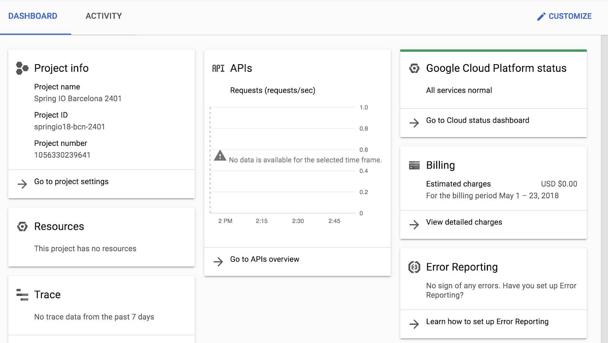

# Lab title

## Overview

Here's a nice overview....

### Objectives

In this lab, you will learn how to perform the following tasks:

*   Cool 1
*   Cool 2
*   Cool 3

## Task 0. Lab Setup

In this task, you use Qwiklabs and perform initialization steps for your lab.

### Access Qwiklabs

![[/fragments/startqwiklab]]

After you complete the initial sign-in steps, the project dashboard appears.



Click __Select a project__, highlight your _GCP Project ID_, and click
__OPEN__ to select your project.

![[/fragments/cloudshell]]

## Task 1. Do something important

In this task, you will:

*   Cool 1
*   Cool 2


### Cool 1
Perhaps we overview cool 1

1.  A step

1.  A step

### Cool 2
Perhaps we overview cool 2

1.  A step

1.  A step

## Review

You could have a review down here, or if you prefer:

<aside><p><strong>Congratulations!</strong>You have done cool things. This also works well for important notes</p></aside>


![[/fragments/endqwiklab]]


![[/fragments/copyright]]


-----------------------------------
# Here down needs to be removed

This is a test `Doug`

Text is just text.

1.  A step

2.  You can number them yourself or just leave them all 1.

```
A copy/paste box (make sure there's a space above the delimiters)
```

_italics_ *also italics* and this is __bold__ and so is **this**,

Here's a table:
|Heading 1|Heading 2|
|-----|----|
|Stuff|Stuff|
|Stuff|Stuff|

Picture


Link
[Kubernetes](https://kubernetes.io/)

Bullet list
*   Bullet
*   Bullet

## Task

### Part of a task

#### Part of a part of a task (or don't use)

<aside><p><strong>Note:</strong>This is really important</p></aside>


