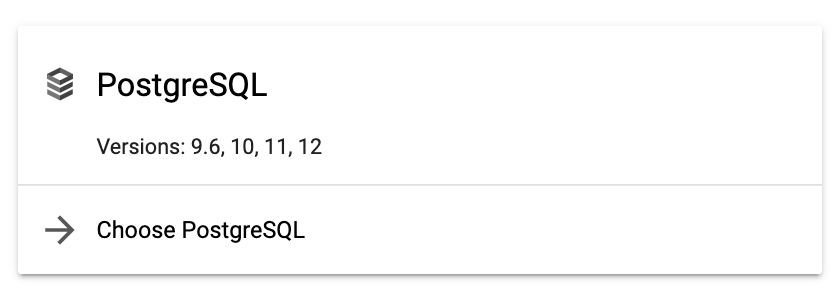
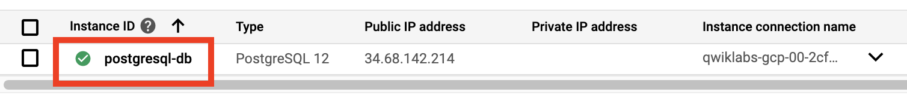
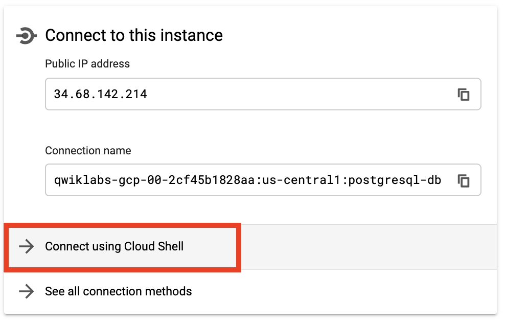

# Creating Cloud SQL Databases 

## Overview

In this lab, you will use Google Cloud SQL to create databases that are managed by Google. You will create both PostgreSQL and MySQL databases and you will connect to those databases using the Google Cloud CLI and from a virtual machine.

### Objectives

In this lab, you will learn how to perform the following tasks:

*   Create a Cloud SQL PostgreSQL database
*   Connect to the database using the Google Cloud SDK
*   Create to a Cloud SQL MySQL database using the CLI
*   Connect to the MySQL database from a Virtual Machine


## Task 0. Lab Setup

In this task, you use Qwiklabs and perform initialization steps for your lab.

### Access Qwiklabs

![[/fragments/startqwiklab]]

After you complete the initial sign-in steps, the project dashboard appears.


Click __Select a project__, highlight your _GCP Project ID_, and click
__OPEN__ to select your project.

![[/fragments/cloudshell]]

## Task 1. Create a Cloud SQL PostgreSQL database

1.  In the Navigation menu (  ), scroll down to the Storage section and click on **SQL**.

2.  Click on the **Create Instance** button, and choose the `PostgreSQL` option.



3.  Name the instance `postgresql-db` and enter a password you can remember (*or click the Generate button and copy the generated password to a text file if you prefer*).

4.  Accept all the rest of the defaults and click the **Create** button.

<aside><p><strong>Note:</strong> It will take a few minutes for your database to be ready. </p></aside>

5.  When the database is ready, click on its name in the console to see its details.



## Task 2. Connect to the database using the Google Cloud SDK

1.  In the **Connect to this instance** section, click the **Connect using Cloud Shell** link. This opens Cloud Shell at the bottom of the screen.




2.  Note the connection command is already entered at the prompt. Hit Enter to run the command. <p>It will take a little while for Cloud Shell's IP address to be whitelisted by the Cloud SQL network. Enter your password when prompted.

3.  To see the databases type the following (*that's a backslash and the lower case letter L*). 

```
\l
```

4.  Enter the following command to create a database.

```
CREATE DATABASE petsdb;
```
5.  See if it worked.

```
\l
```

6.  To connect to the database, enter the following command an your password when prompted.

```
\c petsdb;
```

7.  Create a table.

```
CREATE TABLE Pets(ID INT PRIMARY KEY NOT NULL, Name TEXT, Breed TEXT);
```

8.  Add a record.

```
INSERT INTO Pets (ID, Name, Breed) Values (1, 'Noir', 'Schnoodle');
```

9.  Run a query.
```
SELECT * FROM Pets;
```

10.  Type Ctrl+c to disconnect from the database and return to Cloud Shell. 

## Task 3. Create to a Cloud SQL MySQL database using the CLI

1.  At the Cloud Shell command prompt, enter the following command to create a MySQL database using the CLI. *It will take a few minutes for the database to ready.*

```
gcloud sql instances create mysql-db --tier=db-n1-standard-1 --zone=us-central1-a
```

2.  When the command completes, make note of the database server's primary IP address. Copy and paste this address in a text file as you will need it later.

3.  Enter the following command to set the password for the root account. ***Make the password something you can remember.***

```
gcloud sql users set-password root --host=% --instance=mysql-db --password=your-password-here
```

4.  Enter the following command to connect to your Cloud SQL database using the CLI. *It will take a little while for Cloud Shell's IP address to be whitelisted by the Cloud SQL network.* <p>Enter your password when prompted.</p>

```
gcloud sql connect mysql-db --user=root --quiet
```

5.  At the mysql prompt just type the following to ensure it works. 

```
SHOW DATABASES;
```

6.  Type `exit` to return the the Cloud Shell command prompt.

## Task 4. Connect to the MySQL database from a Virtual Machine

1.  In Cloud Shell, enter the following command to create a Debian 9 virtal machine that you can use as a test client.

```
gcloud compute instances create test-client --zone=us-central1-a --image=debian-9-stretch-v20200521 --image-project=debian-cloud
```

2.  When the command completes, copy the external IP address to the clipboard. You have to allow this machine access to the database. 

3.  Return to the Console and the Cloud SQL service. Click on the `mysql-db` database to see its details. <p>On the left, click on the **Connections** section. Then, click on the **Add Network** button. Paste the virtual machines external IP address in the Network text box. </p><p>Click the **Done** and the **Save** buttons.

4.  Back in Cloud Shell, enter the following command to SSH into the test client.

```
gcloud compute ssh test-client --zone=us-central1-a
```

5.  Use the following commands to install the MySQL client software on this machine.

```
sudo apt-get update
sudo apt-get install -y mysql-client
```

6.  Now, try logging onto the database server. Use the command below, but change the IP address to your Cloud SQL database's IP address. (***You should have pasted this address in a text file earlier in the lab. If not, you can find it in the Cloud SQL console.***)

```
mysql --host=[Database Public IP Address] --user=root --password
```

7.  At the mysql prompt just type the following to ensure it works. 

```
SHOW DATABASES;
```

8.  Type `exit` to return the the Cloud Shell command prompt.  


<aside><p><strong>Congratulations! </strong>You have used Google Cloud SQL to create databases that are managed by Google. You created both PostgreSQL and MySQL databases and you connected to those databases using the Google Cloud CLI and from a virtual machine.</p></aside>


![[/fragments/endqwiklab]]


![[/fragments/copyright]]
