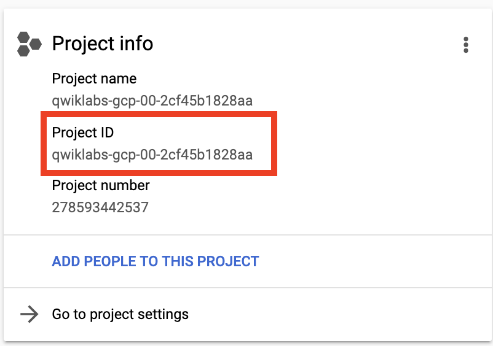

# Use Terraform to Create a Network Peering

## Overview

In this lab, you will peer two networks. This will allow communication between machines in those networks using internal IP addresses. This means databases can be deployed on a private network without external IP addresses, and those database will only be reachable from from the peered network.

### Objectives

In this lab, you will learn how to perform the following tasks: 

*   Peer two networks
*   Deploy a VM with no external IP 

## Task 0. Lab Setup

In this task, you use Qwiklabs and perform initialization steps for your lab.

### Access Qwiklabs

![[/fragments/startqwiklab]]

After you complete the initial sign-in steps, the project dashboard appears.


Click __Select a project__, highlight your _GCP Project ID_, and click
__OPEN__ to select your project.

![[/fragments/cloudshell]]

## Task 1. Peer two networks

1.  In the Navigation menu (  ), click on **Home**.

2.  In the **Project info** section, find your Project ID and copy and paste it into a text file. You will need it later.



3.  In the Console, click on the **Activate Cloud Shell** icon in the upper right of the console.  <p>The Cloud Shell terminal will open in a pane at the bottom.</p>

4.  Enter the following command to clone a GitHub repository which includes a completed version of the last lab. 

```
git clone https://github.com/drehnstrom/db-migration-course
```

5.  Change to the following folder.

```
cd ~/db-migration-course/terraform-create-peering/
```

6.  Type `ls` and you will see this folder has the Terraform files to create two networks and a couple test servers. 

7.  Click on the **Open Editor** button. Open the `terraform.tfvars` file in the `db-migration-course/terraform-create-peering/` folder.<p>Change the `project_id` variable to match your project's ID.</p>

8.  Enter the following commands to initialize Terraform and create the resources. 

```
terraform init
terraform plan
terraform apply -auto-approve
```

9.  When the Terrform process completes, in the Navigation menu (  ), click on **Compute Engine**.

10.  You should have two machines. One in the public network and one in the private network.<p>Copy the internal IP address of the private machine to the clipboard (*it should be 10.2.2.2*). </p><p>Then, SSH into the one with the name that begins with `public-test-server-`.</p>

11.  Try to ping the private machine (***at this point it shouldn't work***). 

```
ping 10.2.2.2
```

<aside><p><strong>Note: </strong>To allow communication between two GCP networks via their internal IP addresses you need to peer them. You will do that now. </p></aside>

12.  In the Navigation menu (  ), click on **VPC network > VPC network peering**.

13.  Notice there are no peered networks at this point. You could setup the peering here in the Console, but it would be more automated and reproducable to use Terraform. 

Back in Cloud Shell, make sure you are in the `cd ~/db-migration-course/terraform-create-peering/` folder and create a file called `vpc-peering.tf`.

```
cd ~/db-migration-course/terraform-create-peering/
touch vpc-peering.tf
```

Click on the **Open Editor** button. Find the file you just created and add the following code to it. 

```
resource "google_compute_network_peering" "public-private" {
  name         = "peering1"
  network      = google_compute_network.public-vpc.self_link
  peer_network = google_compute_network.private-vpc.self_link
}

resource "google_compute_network_peering" "private-public" {
  name         = "peering2"
  network      = google_compute_network.private-vpc.self_link
  peer_network = google_compute_network.public-vpc.self_link
}
```

<aside><p><strong>Note: </strong>A peering request has to be made from both networks. That is why there are two network  peerings, one from the public network to the private network and one in the opposite direction. </p></aside>

14.  Switch back to the Cloud Shell terminal and enter the following to create the peering.  

```
terraform apply -auto-approve
```
15.  After the command completes, go back to the Console. Navigate away from the VPC network peering page, and then back to it, to refresh the view. You should see the peering is created and active. 

16.  Switch back to the SSH window of the public test server and your ping command should have started working. Type **Ctrl+ C** to stop the command and then type `exit` to close the SSH session. 

## Task 2. Deploy a VM with no external IP 

1.  As you can see, once the networks are peered, machines in the private network do not need a public IP addresss. In Cloud Shell, switch to the Code Editor, and then open the file `private-test-server-linux.tf`.

2.  In the `network_interface` section, comment out the line that reads `access_config { }` (*line 19*). Comments in Terrafom use the "#" character<p>This will cause the VM to be created without an external IP address.</p>

3.  Since there is no longer going to be an external IP address, you can't output its value. Find the code that outputs the VM's external IP and change it to the string "NONE". It should be line 29. See the example below.

```
output "private-test-server-linux-external-ip" {
  value = "NONE"
}
```

4.  Go back to the Cloud Shell terminal and apply your change. 

```
terraform apply -auto-approve
```

5.  When the Terraform command completes, in the Console go to the **Compute Engine** service. You should see the private VM now has no external IP. SSH into the public VM and make sure you can still ping the private server via its internal IP.

6.  Go back the the Cloud Shell terminal and delete everything.

```
terraform destroy -auto-approve
```

<aside><p><strong>Congratulations!</strong>You have .... </p></aside>


![[/fragments/endqwiklab]]


![[/fragments/copyright]]
