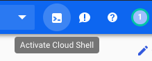

# Using Terraform to Create Clients and Servers

## Overview

In this lab, you will provision a Linux virtual machine in a private network to act as a database server. You will also create a virtual machine that you can use as a bastion host to connect to the database server as an administrator. You will configure the database server for remote connections and add a user account. You will then install the MySQL client software to connect to the database server from a client machine.

### Objectives

In this lab, you will learn how to perform the following tasks: 

*   Create Client and Server VMs
*   Administrate your Database Server
*   Connect to the database from a client


## Task 0. Lab Setup

In this task, you use Qwiklabs and perform initialization steps for your lab.

### Access Qwiklabs

![[/fragments/startqwiklab]]

After you complete the initial sign-in steps, the project dashboard appears.


Click __Select a project__, highlight your _GCP Project ID_, and click
__OPEN__ to select your project.

![[/fragments/cloudshell]]

## Task 1. Create Client and Server VMs

1.  In the Navigation menu (  ), click on **Home**.

2.  In the **Project info** section, find your Project ID and copy and paste it into a text file. You will need it later.

3.  In the Console, click on the **Activate Cloud Shell** icon in the upper right of the console.  <p>The Cloud Shell terminal will open in a pane at the bottom.</p>

4.  Enter the following command to clone a GitHub repository which includes a completed version of the last lab. 

```
git clone https://github.com/drehnstrom/db-migration-course
```

5.  Change to the following folder.

```
cd ~/db-migration-course/terraform-clients-servers/
```

6.  Type `ls` and you will see this folder has the Terraform files completed from the last lab. 

7.  Click on the **Open Editor** button. Open the `terraform.tfvars` file in the `db-migration-course/terraform-clients-servers/` folder.<p>Change the `project_id` variable to match your project's ID.</p>

8. First, you will create a Debian Linux machine in the private network. Add a file named `vm-mysql-server.tf` and paste the following Terraform code into it. 

```
# Create a MySQL Server in Private VPC
resource "google_compute_instance" "mysql-server" {
  name         = "mysql-server-${random_id.instance_id.hex}"
  machine_type = "f1-micro"
  zone         = var.gcp_zone_1
  tags         = ["allow-ssh", "allow-mysql"]

  boot_disk {
    initialize_params {
      image = "debian-cloud/debian-9"
    }
  }

  network_interface {
    network        = google_compute_network.private-vpc.name
    subnetwork     = google_compute_subnetwork.private-subnet_1.name
  #  access_config { } 
  }
} 

output "mysql-server" {
  value = google_compute_instance.mysql-server.name
}

output "mysql-server-external-ip" {
  value = "NONE"
}

output "mysql-server-internal-ip" {
  value = google_compute_instance.mysql-server.network_interface.0.network_ip
}
```

9. Now, you will create a machine in the public network that use can use to administrate that server. Add a file named `vm-mysql-client.tf` and paste the following Terraform code into it. 

```
# Create MySQL Client in Public VPC
resource "google_compute_instance" "mysql-client" {
  name         = "mysql-client-${random_id.instance_id.hex}"
  machine_type = "f1-micro"
  zone         = var.gcp_zone_1
  tags         = ["allow-ssh"]

  boot_disk {
    initialize_params {
      image = "debian-cloud/debian-9"
    }
  }

  network_interface {
    network        = google_compute_network.public-vpc.name
    subnetwork     = google_compute_subnetwork.public-subnet_1.name
    access_config { } 
  }
} 


output "mysql-client" {
  value = google_compute_instance.mysql-client.name
}

output "mysql-client-external-ip" {
  value = google_compute_instance.mysql-client.network_interface.0.access_config.0.nat_ip
}

output "mysql-client-internal-ip" {
  value = google_compute_instance.mysql-client.network_interface.0.network_ip
}
```

<aside><p><strong>Note: </strong>Since this server is in the public network, you will be able to SSH into it. Once there, you will be able to SSH into the MySQL Server in the private network to administrate it. </p></aside>


10. Lastly, you need to create a firewall rule to allow communication to the MySQL Server from the public network. Open the file `vpc-firewall-rules-private.tf` and add the following firewall rule to the end. 

```
# allow MySQL only from public subnet
resource "google_compute_firewall" "private-allow-mysql" {
  name    = "${google_compute_network.private-vpc.name}-allow-mysql"
  network = google_compute_network.private-vpc.name
  allow {
    protocol = "tcp"
    ports    = ["3306"]
  }
  source_ranges = [
    "${var.subnet_cidr_public}"
  ]
  target_tags = ["allow-mysql"] 
}
```

11.  Return the the Cloud Shell terminal and enter the following commands to initialize Terraform and create the plan. 

```
terraform init
terraform plan
```

12.  Assuming there are no errors, run the following command to create the resources. 

```
terraform apply -auto-approve
```

## Task 2. Administrate your Database Server

1.  When the Terrform process completes, in the Navigation menu (  ), click on **Compute Engine**. You should have a number of machines listed. 

2.  Find the `mysql-server-` machine, and make note of its internal IP address (*it is probably 10.2.2.3*). 

3.  Find the `mysql-client-` machine, and click the SSH button next to it to connect to that machine. 

4. Once you're connected to the client, then use the following command to SSH from that machine to the server making sure the IP address is correct. <p>When prompted, say 'yes'.</p> 

```
ssh 10.2.2.3
```

<aside><p><strong>Note: </strong>At this point you need to install MySQL on the server. The problem is, because the Server has no External IP address, it has no access to the internet. So, you can't run the command to install MySQL. You will fix that now by adding a NAT using the Google Cloud NAT service. </p></aside>

5.  Try the following command and you will see it doesn't work. It will fail when trying to access the Internet.

```
sudo apt install -y mysql-server
```

6.  Type Ctrl+c to end the command.


7.  Go back to the Console, and navigate to **Network services > Cloud NAT**.

8. Click on the **Get started** button. You could create the NAT right here by filling in the form. However, that would not be reproducable. Let's do this in Terraform instead. Click the **Cancel** button.

9.  Go back to the Cloud Shell Code Editor. In the `db-migration-course/terraform-clients-servers` folder, add a file called `cloud-nat.tf`. Add the following Terraform code to that file.

```
resource "google_compute_router" "nat-router" {
  name    = "nat-router"
  region  = google_compute_subnetwork.private-subnet_1.region
  network = google_compute_network.private-vpc.id

  bgp {
    asn = 64514
  }
}

resource "google_compute_router_nat" "private-nat" {
  name                               = "private-nat"
  router                             = google_compute_router.nat-router.name
  region                             = google_compute_router.nat-router.region
  nat_ip_allocate_option             = "AUTO_ONLY"
  source_subnetwork_ip_ranges_to_nat = "ALL_SUBNETWORKS_ALL_IP_RANGES"

  log_config {
    enable = true
    filter = "ERRORS_ONLY"
  }
}
```

10.  Return the the Cloud Shell Terminal and run `terraform plan` and make sure you have no errors. 

11.  Run `terraform apply -auto-approve` to create the NAT.

12.  Return to your SSH window that is connected to the MySQL Server. Run the following commands to install MySQL (*this time it should work*).

```
sudo apt-get update
sudo apt-get install -y mysql-server
```

13.  Enter the following command to ensure MySQL is running.

```
sudo systemctl status mysql
```

14.  Now create a password for the root user with the following command. The inital password will be blank. Follow the instructions to create a password for root using a password you will remember. Say `Yes` to all the remaining prompts.

```
sudo mysql_secure_installation
```

15.  Now log onto the database using the root account with the following command. Enter your password when prompted. 

```
sudo mysql -u root -p
```

16. You will need a user account to login with from the client machine. Use the following command to create a user named `fred` with the password `password`.

```
CREATE USER 'fred'@'%' IDENTIFIED BY 'password';
GRANT ALL PRIVILEGES ON * . * TO 'fred'@'%';
FLUSH PRIVILEGES;
```

17. Type `exit` to exit the MySQL client. 

18.  By default the database server only listens for connections on the local machine. A quick fix to the configuration will change that. Use the following command to open the configuration file in the Nano text editor. 

```
sudo nano /etc/mysql/mariadb.conf.d/50-server.cnf 
```

19.  Find the line shown below and comment it out.  

```
bind-address            = 127.0.0.1
```

20. Type Ctrl-x to exit and answer "y" when prompted to save your changes. 

21. Ener the follwing command to restart the database. 

```
sudo /etc/init.d/mysql restart
```

22.  Type `exit` again to leave the server and return the client VM.

## Task 3. Connect to the database from a client

1. Now let's see if you can connect to the MySQL database from your client machine. Enter the follwing commands to install the MySQL client software.

```
sudo apt-get update
sudo apt-get install -y mysql-client
```

2. Now try to connect to your database using the following command.

```
mysql -h 10.2.2.3 -u fred -p'password'
```

3. You should get conected. At this point there's no database, so there's nothing else to do, but you have a complete solution in place. <p>Your database server is in a secure network with no public access. You have a Linux machine in the public network that can be used to administrate the database, and connect to the machine using the MySQL client software.

4.  Close your SSH session. Then, return to the Cloud Shell terminal. Enter the following command to delete everything you create earlier in the lab.

```
terraform destroy -auto-approve
```

<aside><p><strong>Congratulations!</strong>You have provisioned a Linux virtual machine in a private network to act as a database server. You also created a virtual machine that you can use as a bastion host to connect to the database server as an administrator. You configured the database server for remote connections and added a user account. You then installed the MySQL client software to connect to the database server from a client machine. </p></aside>


![[/fragments/endqwiklab]]


![[/fragments/copyright]]
