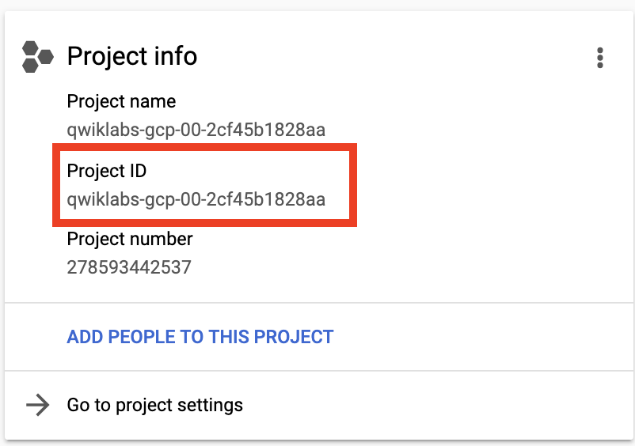

# Creating SQL Server Databases on Compute Engine

## Overview

In this lab, you will provision a SQL Server machine in a private network. Then, you will create a Windows machine in a public network that you can use to adminstrate the database server. You will also create a Linux client in the public network that can be used to connect to the database. Lastly, you will setup a firewall rule that allows access to the SQL Server database only from the private network.

### Objectives

In this lab, you will learn how to perform the following tasks:

*   Create Client and Server VMs
*   Administrate your Database Server
*   Connect to the database from a client

## Task 0. Lab Setup

In this task, you use Qwiklabs and perform initialization steps for your lab.

### Access Qwiklabs

![[/fragments/startqwiklab]]

After you complete the initial sign-in steps, the project dashboard appears.


Click __Select a project__, highlight your _GCP Project ID_, and click
__OPEN__ to select your project.

![[/fragments/cloudshell]]

## Task 1. Create Client and Server VMs

1.  In the Navigation menu (  ), click on **Home**.

1.  In the **Project info** section, find your Project ID and copy and paste it into a text file. You will need it later.



1.  In the Console, click on the **Activate Cloud Shell** icon in the upper right of the console.  <p>The Cloud Shell terminal will open in a pane at the bottom.</p>

1.  Enter the following command to clone a GitHub repository which includes a completed version of the last lab. 

```
git clone https://github.com/drehnstrom/db-migration-course
```

1.  Change to the following folder.

```
cd ~/db-migration-course/terraform-sql-server-on-gce/
```

1.  Type `ls` and you will see this folder has the Terraform files complete from the last lab. 

1.  Click on the **Open Editor** button. Open the `terraform.tfvars` file in the `db-migration-course/terraform-networks-peered/` folder.<p>Change the `project_id` variable to match your project's ID.</p>

1. First, you will create a SQL Server machine n the private network. Add a file named `vm-sql-server-windows.tf` and paste the following Terraform code into it. 

```
# Create Windows SQL Server in Private VPC
resource "google_compute_instance" "sql-server-windows" {
  name         = "sql-server-windows-${random_id.instance_id.hex}"
  machine_type = "n1-standard-2"
  zone         = var.gcp_zone_1
  tags         = ["allow-rdp", "allow-sql"]

  boot_disk {
    initialize_params {
      image = "windows-sql-cloud/sql-2017-express-windows-2016-dc-v20200414"
    }
  }

  network_interface {
    network        = google_compute_network.private-vpc.name
    subnetwork     = google_compute_subnetwork.private-subnet_1.name
    # access_config { } - Remove access_config for no External IP
  }
} 

output "sql-server-windows" {
  value = google_compute_instance.sql-server-windows.name
}

output "sql-server-windows-external-ip" {
  value = "NONE"
}

output "tsql-server-windows-internal-ip" {
  value = google_compute_instance.sql-server-windows.network_interface.0.network_ip
}
```

1. Now, you will create a Windows machine in the public network that use can use to administrate that SQL Server. Add a file named `vm-windows-admin.tf` and paste the following Terraform code into it. 

```
# Create VM Windows Admin
resource "google_compute_instance" "windows-admin" {
  name         = "windows-admin-${random_id.instance_id.hex}"
  machine_type = "n1-standard-2"
  zone         = var.gcp_zone_1
  tags         = ["allow-rdp"]

  boot_disk {
    initialize_params {
      image = "windows-cloud/windows-server-2016-dc-v20200424"
    }
  }

  network_interface {
    network       = google_compute_network.public-vpc.name
    subnetwork    = google_compute_subnetwork.public-subnet_1.name
    access_config { }
  }
} 

output "windows-admin-name" {
  value = google_compute_instance.windows-admin.name
}

output "windows-admin-external-ip" {
  value = google_compute_instance.windows-admin.network_interface.0.access_config.0.nat_ip
}

output "windows-admin-internal-ip" {
  value = google_compute_instance.windows-admin.network_interface.0.network_ip
}
```

<aside><p><strong>Note: </strong>Since this server is in the public network you will be able to RDP into it. Once there, you will be able to RDP into the SQL Server in the private network to administrate it. </p></aside>

1.  Let's create one more machine. This will be a Linux client that we can use to connect to the SQL Server. Add another file named `vm-sql-client.tf`, and add the following Terraform code to it. 

```
# Create VM SQL Client
resource "google_compute_instance" "sql-client" {
  name         = "sql-client-${random_id.instance_id.hex}"
  machine_type = "f1-micro"
  zone         = var.gcp_zone_1
  tags         = ["allow-ssh"]

  boot_disk {
    initialize_params {
      image = "ubuntu-os-cloud/ubuntu-1604-xenial-v20200429"
    }
  }

  metadata_startup_script = "sudo apt-get update;"

  network_interface {
    network       = google_compute_network.public-vpc.name
    subnetwork    = google_compute_subnetwork.public-subnet_1.name
    access_config { }
  }
} 

output "sql-client-name" {
  value = google_compute_instance.sql-client.name
}

output "sql-client-external-ip" {
  value = google_compute_instance.sql-client.network_interface.0.access_config.0.nat_ip
}

output "sql-client-internal-ip" {
  value = google_compute_instance.sql-client.network_interface.0.network_ip
}
```
<aside><p><strong>Note: </strong>This is an Unbuntu Linux machine that you will install the SQL Server client software on and test the connection to the SQL Server database. </p></aside>

1. Lastly, you need to create a firewall rule to allow communication to the SQL Server from the private network. Open the file `vpc-firewall-rules-private.tf` and add the following firewall rule to the end. 

```
# allow SQL only from public subnet
resource "google_compute_firewall" "private-allow-sql" {
  name    = "${google_compute_network.private-vpc.name}-allow-sql"
  network = google_compute_network.private-vpc.name
  allow {
    protocol = "tcp"
    ports    = ["1433"]
  }
  source_ranges = [
    "${var.subnet_cidr_public}"
  ]
  target_tags = ["allow-sql"] 
}
```

1.  Return the the Cloud Shell terminal and enter the following commands to initialize Terraform and create the plan. 

```
terraform init
terraform plan
```

1.  Assuming there are no errors, run the following command to create the resources. 

```
terraform apply -auto-approve
```

## Task 2. Administrate your Database Server

1.  When the Terrform process completes, in the Navigation menu (  ), click on **Compute Engine**.

1.  You should have a number of machines listed. You will need to keep track of usernames and passwords. To do that, open a text editor on your computer and paste the following template into it.

```
Windows Admin RDP Login
Username: 
Password: 


SQL Server RDP Login
Internal IP:
Username: 
Password: 


SQL Server User 
Username: 
Password: 

```

1.  Find the `windows-admin-` machine, click the dropdown next to the RDP button and select **Set Windows password**. Change the username to anything name you like and click **Set** button to generate the password. Copy the password to the clipboard. Then, record the username and password in the text file you created.

1.  In the same way generate a username and password for the machine with the name `sql-server-windows-`. Don't forget to record the username and password in your text file.<p>Also, find the internal  IP address of your SQL Server machine and record it in your text file.</p>

1.  RDP into the Windows Admin machine. 

1.  Once you are logged into the admin machine, click on the Windows Start menu and select the Remote Dektop shortcut. *You can close the Server Manager dashboard if you like*. 

1.  Enter the internal IP address of the SQL Server and click **Connect**. Then, log in with the username and password you recorded. You should get logged onto the SQL Server machine. *You can close the Server Manager dashboard on this machine too*. 

1.  Now you will create a SQL Server user login. Click the Start menu of the SQL Server and type "ssms", then select the shortcut to Microsoft SQL Server Management Studio.

1.  Once, Management Studo starts, the local server name should already be filled in. Click the **Connect** button to log into it. 

1.  In Object Explorer, right-click on the Server at the top and select **Properties**. <p>Click on the **Security** tab, and then select the **SQL Server and Windows authentication mode** radio button. </p><p>Click the **OK** button and read the message, then click OK to dismiss it. 

1.  To restart the SQL Server, right-click on it again in Object Explorer and select **Restart**. Agree when prompted. Give the server a few seconds to restart, you might have to click the Refresh button to see that it is restarted. 

1.  In Object Explorer, double-click on Security and then Logins to expand them. Right-click on **Logins** and select **New  Login**.  <p>Specify a username in the Login-name text box.</p><p>Select the **SQL Server authentication** radio button.</p><p>Set the password and uncheck the **Enforce password policy** check box. </p><p>Click to **OK** button to create the login.

1.  Record the username and passoword for the SQL Server user you just created in your text file.

1.  Close the remote desktop session to the SQL Server machine and the RDP connection to the Windows Admin machine.

## Task 3. Connect to the database from a client

1.  Go back to the Google Cloud Console and the Compute Engine service. 

1.  Click the **SSH** button next to the `sql-client-` machine. 

1. You will now install the SQL Server client software on this machine and test the Login you just created. Once your SSH connection is established enter the following commands (***say yes each time you are prompted***).

```
curl https://packages.microsoft.com/keys/microsoft.asc | sudo apt-key add -
curl https://packages.microsoft.com/config/ubuntu/16.04/prod.list | sudo tee /etc/apt/sources.list.d/msprod.list
sudo apt-get update 
sudo apt-get install mssql-tools unixodbc-dev
```
1.  Enter the following commands so the SQL client is in your path.

```
echo 'export PATH="$PATH:/opt/mssql-tools/bin"' >> ~/.bash_profile
echo 'export PATH="$PATH:/opt/mssql-tools/bin"' >> ~/.bashrc
source ~/.bashrc
```

1.  Enter the following command using your machine's IP address and the SQL Server username you created. Enter the password when prompted. 

```
sqlcmd -S 10.2.2.3,1433 -U username
```

1.  If you don't get an error, your client login worked. At this point there's no database, so there's nothing else to do, but you have a complete solution in place. <p>Your database server is in a secure network with no public access. You have a Windows machine in the public network that can be used to administrate the database, and you have a client machine that can access the database via the SQL Server port.

1.  Type quit to exit the sqlcmd and then close your SSH session. Then, return to the Cloud Shell terminal. Enter the following command to delete everything you create earlier in the lab.

```
terraform destroy -auto-approve
```

<aside><p><strong>Congratulations!</strong>You have provisioned a SQL Server machine in a private network. Then, you created a Windows machine in a public network that you used to adminstrate the database server. You also created a Linux client in the public network was used to connect to the database. Lastly, you setup a firewall rule that allowed access to the SQL Server database only from the private network. </p></aside>


![[/fragments/endqwiklab]]


![[/fragments/copyright]]
