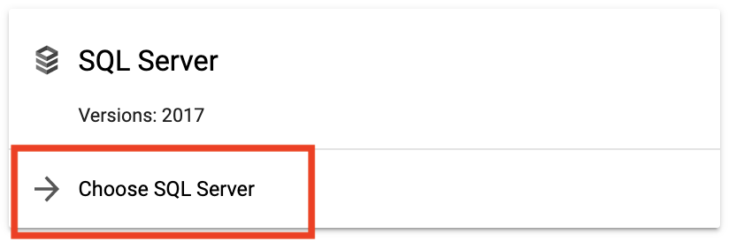
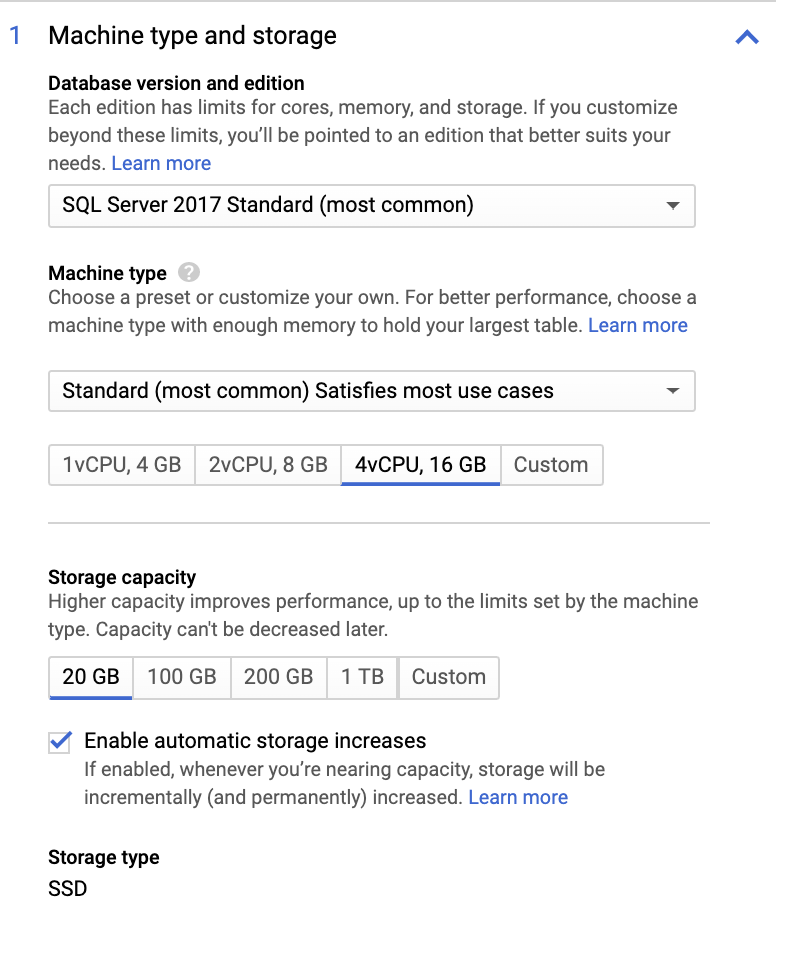
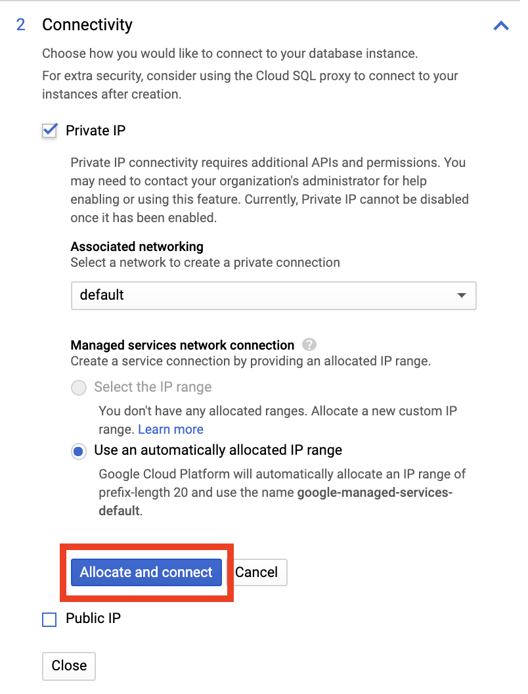
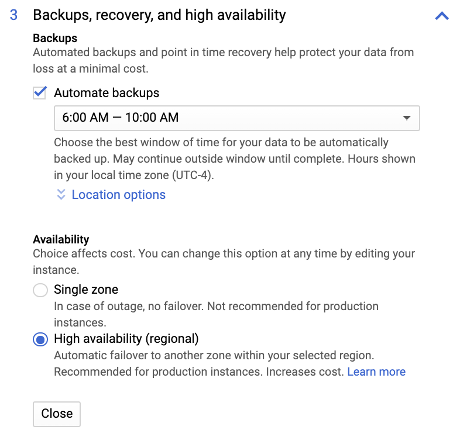
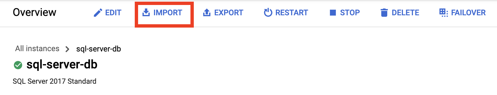
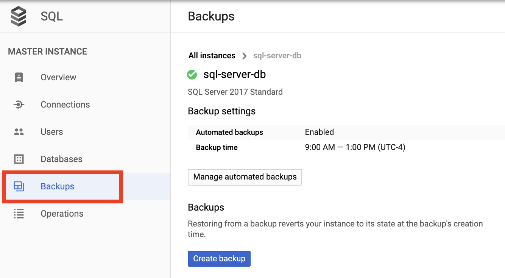
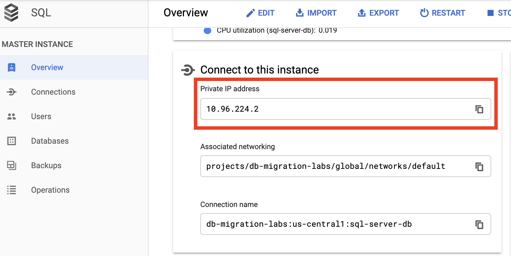
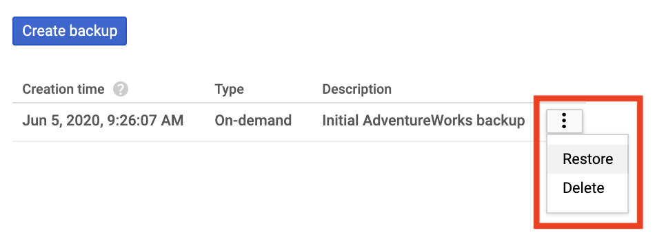
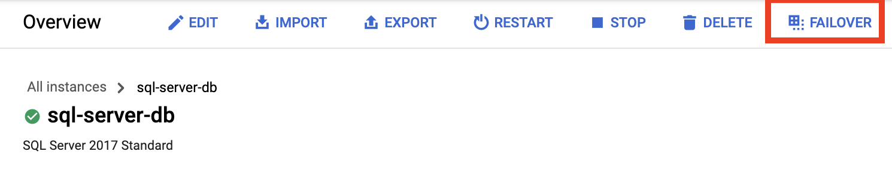

# Administering a Highly Available Cloud SQL for SQL Server Database

## Overview

In this lab, you will create a SQL Server database using Google Cloud SQL. You will enable high availability and deploy it securely with only a private IP address. You will then load a sample database into it and connect to the database using a client machine. You will also perform backup and restore operations and test high availability by triggering a failover.

### Objectives

In this lab, you will learn how to perform the following tasks:

*   Create a secure, highly-available SQL Server database using Cloud SQL
*   Perform backup and restore operations
*   Connect to the database using its private IP address
*   Trigger a failover to test high availability


## Task 0. Lab Setup

In this task, you use Qwiklabs and perform initialization steps for your lab.

### Access Qwiklabs

![[/fragments/startqwiklab]]

After you complete the initial sign-in steps, the project dashboard appears.


Click __Select a project__, highlight your _GCP Project ID_, and click
__OPEN__ to select your project.

![[/fragments/cloudshell]]

## Task 1. Create a secure, highly-available SQL Server database using Cloud SQL

1.  In the Navigation menu (  ), scroll to the Storage section and click on **SQL**.

2.  Click the **Create Instance** button, and then choose **SQL Server**.



3.  Name your database `sql-server-db` and then click the **Generate** button next to the password text box. Copy and paste your generated password into a text file so you don't lose it. ***If you prefer you can just enter a password that you can remember***. <p>Choose the zone `us-central1-a`</p>

4.  Expand the **Machine type and storage** section. <p>Choose the **Standard** edition of SQL Server.<p>Change the machine type to **4vCPUs, 16GB**.<p>Leave storage capacity at 20GB and make sure the **Enable automatic storage increases** is checked.



5. Expand the **Connectivity** section. Check the **Private IP** checkbox. Click the **Enable API** button when prompted. <p>**Note:** *An Associated networking dropdown will appear just below the Private IP checkbox. This is the network that will be peered to the network Google manages your Cloud SQL database in. This is just like what you did earlier in the course when you created public and private networks and setup a peering between them.* <p>Click on the **Allocate and connect** button (*this will take a minute*). Then, **uncheck** the Public IP checkbox.



6.  Expand the **Backups, recovery and high availability** section. Check the box to enable automatic backups. <p>Also, select the **High availability** radio button. *This will create a failover replica in another zone in the same region.*




7. Finally, click the **Create** button to create your database server. <p>*This will take a few minutes, but you can continue with the next few steps while you are waiting*. 

## Task 2. Perform backup and restore operations


1.  In the Console, click on the **Activate Cloud Shell** icon in the upper right of the console.  <p>The Cloud Shell Terminal will open in a pane at the bottom.</p>

2.  Enter the following command to download a sample database you will use in this exercise. 

```
curl -O https://storage.googleapis.com/cloud-training/dbmigration/Adventure
WorksLT2017.bak
```

3.  Type `ls`. Notice, there is a SQL backup file, `AdventureWorksLT2017.bak` which will allow you to restore the Microsoft Adventure Works sample database. 

4.  In Cloud Shell, there is an environment variable that is set to your current project's ID. To see that variable, type the following command. 

```
echo $DEVSHELL_PROJECT_ID
```

5. Now you will create a Cloud Storage bucket who's name is the same as your project ID. (*This name should be unique*.)

```
gsutil mb gs://$DEVSHELL_PROJECT_ID
```

6.  Now, copy the Adventure Works backup file into that bucket.

```
gsutil cp ./AdventureWorksLT2017.bak gs://$DEVSHELL_PROJECT_ID
```

7.  Take a look at your Cloud SQL server in the console. If it is ready, you can move on, otherwise take a short break. 

8.  When the server is ready, click on its name to see its details. 

9.  On the **Overview** page, click the **Import** button at the top. 



10.  Browse to your bucket and select the `AdventureWorksLT2017.bak` file. <p>In the Destination section, name the database `AdventureWorks` and lastly click **Import**. <p>*It will take a short time for the import to complete*. 

11.  When the import job completes, click on the **Backups** link on the left. Notice, backups are set to run automatically, but click the button to create a backup now. Set to description to `Initial AdventureWorks backup`. <p>*It will take a short time for the backup to complete*. 



12.  Click on the **Operations** link on the left. Notice, it tracks what has happened on the database so far. 

## Task 3. Connect to the database using its private IP address

1.  Click on the **Users** link on the left. Notice a user named `sqlserver` is automatically created for you. The password for this user is the one you generated when you created the database. *You should have pasted the password in a text file*. <p>You could create additional users at here if you wanted to. 

2.  Click on the **Overview** link on the left. Copy the **Private IP address** to the clipboard and paste it in your text file as well. *You will need this later to connect to the database*. 



3. In Cloud Shell, enter the following gcloud command to create an Ubuntu linux virtual machine. 

```
gcloud compute instances create cloud-sql-client --zone=us-central1-a --image=ubuntu-1604-xenial-v20200521 --image-project=ubuntu-os-cloud 
```

4.  When the command completes, navigate to the **Compute Engine** service. You should see your virtual machine. Click on the **SSH** button next to it. 

5.  Run the following commands to download the Microsoft SQL Server client software. 


```
curl https://packages.microsoft.com/keys/microsoft.asc | sudo apt-key add -
curl https://packages.microsoft.com/config/ubuntu/16.04/prod.list | sudo tee /etc/apt/sources.list.d/msprod.list
```

6. Now, run the following commands to install the software (***when prompted say Yes***).

```
sudo apt-get update 
sudo apt-get install mssql-tools unixodbc-dev
```

7. Lastly, run the following commands to add the client solftware to your path.

```
echo 'export PATH="$PATH:/opt/mssql-tools/bin"' >> ~/.bash_profile
echo 'export PATH="$PATH:/opt/mssql-tools/bin"' >> ~/.bashrc
source ~/.bashrc
```

8.  Enter the following command to connect to your Cloud SQL database, **but change the IP address to match your server's IP**. <p>Enter your password when prompted.

```
sqlcmd -S 10.96.224.2,1433 -U sqlserver
```

9.  To see the databases enter the following two commands:

```
EXEC sp_databases;
go
```

10.  Try querying AdventureWorks.

```
SELECT TOP (10) CompanyName FROM [AdventureWorks].[SalesLT].[Customer];
go
```

11.  Now change all the Company names to Google. 

```
UPDATE [AdventureWorks].[SalesLT].[Customer] SET CompanyName = 'Google';
go
```

12.  Run the SELECT query again to verify your command worked. 

```
SELECT TOP (10) CompanyName FROM [AdventureWorks].[SalesLT].[Customer];
go
```

13.  That was stupid! Let's restore from that backup you created earlier.

14. Go back to **Cloud SQL** in the console. Select your server to view its details and then click the **Backups** link.

15.  Click on the button next to your backup and select **Restore**. Answer OK when prompted.  *This will take a few minutes*.



16.  When the restore operaton completes, return to your client machine and run the SELECT query again to verify your backup was restored correctly. 

```
SELECT TOP (10) CompanyName FROM [AdventureWorks].[SalesLT].[Customer];
go
```

## Task 4. Trigger a failover to test high availability

1. Go back to your Cloud SQL database **Overview** page and click the **Failover** button at the top. 



2.  Enter the database name as instructed and click the **Trigger Failover** button.  *It will take about a minute for the failover operation to finish*.

3.  When the operation completes, go back to your client and try to run your query again. 

4. Let's make a change to one of the records by issueing the following command
```
UPDATE [AdventureWorks].[SalesLT].[Customer] SET CompanyName = 'Google' WHERE CustomerID = 1
go
```

5. Go back to the **Overview** page and this time click the **Fallback** button to return to the main database and confirm that the change made on the FailOver is reflected on the main server.

6. Lastly, you can delete the database. From the **Overview** page click the **Delete** button and follow the instructions. <p>You can also go to the **Compute Engine** service and delete the client machine.


<aside><p><strong>Congratulations! </strong>You have created a SQL Server database using Google Cloud SQL. You enabled high availability and deployed it securely with only a private IP address. You then loaded a sample database into it and connected to the database using a client machine. You also performed backup and restore operations and tested high availability by triggering a failover. </p></aside>


![[/fragments/endqwiklab]]


![[/fragments/copyright]]
