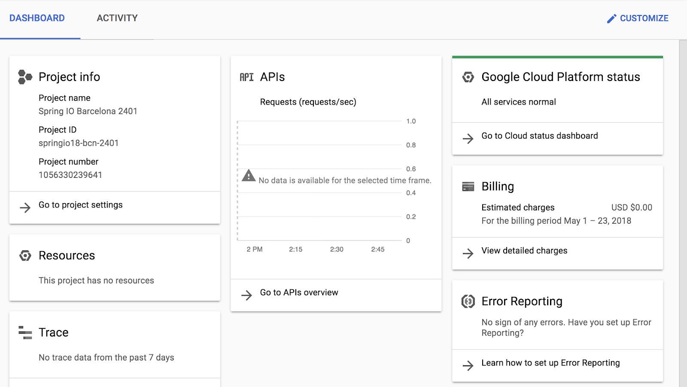

# Running SQL Server on Google Kubernetes Engine 

## Overview

In this lab, you will create a Kubernetes cluster in Google Kubernetes Engine (GKE). You will configure and deploy a Microsoft SQL Server database into the cluster and connect to it from a client machine. Then, you will simplify the deployment using Helm.

### Objectives

In this lab, you will learn how to perform the following tasks:

*   Create a Kubernetes cluster
*   Configure and deploy SQL Server into the cluster
*   Connect to the SQL Server database from a client machine
*   Deploy SQL Server to Kubernetes using Helm

## Task 0. Lab Setup

In this task, you use Qwiklabs and perform initialization steps for your lab.

### Access Qwiklabs

![[/fragments/startqwiklab]]

After you complete the initial sign-in steps, the project dashboard appears.



Click __Select a project__, highlight your _GCP Project ID_, and click
__OPEN__ to select your project.

![[/fragments/cloudshell]]

## Task 1. Create a Kubernetes cluster

1.  In the Console, click on the **Activate Cloud Shell** icon in the upper right of the console.  <p>The Cloud Shell Terminal will open in a pane at the bottom.</p>

2.  Enter the following command to create a Kubernetes cluster (*it will take a few minutes for the cluster to be ready*). 

```
gcloud container clusters create kubernetes-cluster --zone=us-central1-a
```

3.  When the cluster is ready, enter the following command to connect to it. 

```
gcloud container clusters get-credentials kubernetes-cluster --zone us-central1-a 
```

4.  Enter the following commands to test your connection. *It should list the machines (nodes) that make of the cluster*.

```
kubectl get nodes
```

## Task 2. Configure and deploy SQL Server into the cluster


1.  Clone the following GitHub repository which has the SQL Server configuration files already created for you. 

```
git clone https://github.com/drehnstrom/db-migration-course
```

2.  Change to the following folder.

```
cd ~/db-migration-course/sql-server-on-gke
```

3.  Click the **Open Editor** button, and then select the `db-migration-course/sql-server-on-gke` folder. 

4. Select the `volume-claims.yaml` file. This file configures three volumes: one for the SQL Server software, one for the data and one for the transaction logs.

5.  Select the `mssql-deployment.yaml` file. This file configures the SQL Server deployment. <p>On line 15 the Microsoft SQL Server image is specified. <p>**Note** the environment variables starting at line 18 thru 29. These variables accept the license agreement, set the password for the SA account using a Kubernetes secret and specify the paths required by the database.<p>Starting at line 38, the volumes from the previous file are used. 

6.  Select the `mssql-service.yaml` file. The service provides access to the database. In this case, the service is of the type `LoadBalancer`. <p>A load balancer will create a public IP address making the database available outside the cluster. If you removed the last line, the service would have only a private IP address, thus making the database only available from within the cluster. 

7.  Click on the **Open Terminal** button to return the the command line. Enter the following command to create the Kubernetes Secret that is used to set the password.

```
kubectl create secret generic mssql-secrets --from-literal=SA_PASSWORD="Passw0rd!"
```  

<aside><p><strong>Note: </strong>The password has to be a strong one, or the deployment will fail when setting the password for the 'sa' account. </p></aside>

8. Enter the following commands to deploy the database. 

```
kubectl apply -f volume-claims.yaml
kubectl apply -f mssql-deployment.yaml
kubectl apply -f mssql-service.yaml
```

9. Wait a minute for the deployment to succeed. Then type the following to see if the database is ready yet. 

```
kubectl get pods
```

10. If the status is **Running** then move on. Otherwise, wait a few seconds and run the previous command again. 


11.  Now enter the following command to get the IP address of the load balancer. 

```
kubectl get services
```

12.  If the External IP of the Load Balancer reads "Pending", then wait a few seconds and try again. Otherwise, copy the external IP address to the clipboard and paste it in a text file (*you will need it later*). 


## Task 3. Connect to the SQL Server database from a client machine

1.  In the Navigation menu (  ), click on **Compute Engine**. <p>You will now create a virtual machine and connect to the SQL Server database running in the GKE cluster. 

2.  Click the **Create Instance** button. Name the instance `sql-server-client`. <p>In the Boot disk section, click the **Change** button.  From the **Operating System** dropdown select **Container Optimized OS**. Accept the default version and click the **Select** button. <p>Accept the rest of the defaults and click the **Create** button at the bottom of the form.

3. Once the machine is ready, click the **SSH** button to connect to it.

4.  You will now run a Docker container provided by Microsoft that has the SQL Client tools already installed. Enter the following command to start the container in interactive mode. *It will take a few seconds for the container to be downloaded and executed*. 

```
docker run -it mcr.microsoft.com/mssql-tools
```

5.  At the prompt, enter the following command to connect to your SQL Server database running inside the GKE cluster.<p> **Note:** You will have to change the IP address to your load balancer's IP address. 

```
sqlcmd -S 34.71.199.92 -U sa -P Passw0rd!
```

6.  You should get connected. Test your connection with the following.

```
EXEC sp_databases;
GO
```

7.  Exit from the client, close the SSH window and return to Cloud Shell.

8.  Enter the following commands to delete the SQL Server deployment. 

```
kubectl delete -f mssql-service.yaml
kubectl delete -f mssql-deployment.yaml
kubectl delete -f volume-claims.yaml
kubectl delete secrets/mssql-secrets

```

## Task 4. Deploy SQL Server to Kubernetes using Helm

Helm is easier and arguably a better way to deploy your database to Kubernetes. You will use it now. 

1.  You should still be in Cloud Shell and connected to your Kubernetes cluster. Enter the following command to initialize Helm.

```
helm init
```

2.  To use Helm, a service account has to be created on the cluster that gives it administrative rights. Enter the following commands to add this service account with the required permissions.

```
kubectl create serviceaccount --namespace kube-system tiller
kubectl create clusterrolebinding tiller-cluster-rule --clusterrole=cluster-admin --serviceaccount=kube-system:tiller
kubectl patch deploy --namespace kube-system tiller-deploy -p '{"spec":{"template":{"spec":{"serviceAccount":"tiller"}}}}'
```

3.  Now enter the following command to update the Helm packages.

```
helm repo update 
```

4.  Now install Microsoft SQL Server using Helm with the following command. *Note the parameters for setting the license, password and edition*. 

```
helm install --name sql-server stable/mssql-linux --set acceptEula.value=Y --set sapassword=Passw0rd! --set edition.value=Developer
```

5.  Wait a minute and then enter the following command to see if the database is running. 

```
kubectl get pods
```

6. If the status is **Running** then move on. Otherwise, wait a few seconds and run the previous command again. 

7.  Run the following command.

```
kubectl get services
```

<aside><p><strong>Note: </strong>This service has no public IP address, so the database is available from only inside the Kubernetes cluster. Also, note the name of the service. You can use that name when connecting to the cluster, rather than the internal IP address which is subject to change.</p></aside>

8.  Enter the following command to run the Microsoft SQL Tools container from within the Kubernetes cluster. 

```
kubectl run sqltools --image=microsoft/mssql-tools -ti --restart=Never --rm=true -- /bin/bash
```

9.  At the prompt, enter the following command to connect to your SQL Server database running inside the GKE cluster. 

```
sqlcmd -S sql-server-mssql-linux -U sa -P Passw0rd!
```

10.  You should get connected. Test your connection with the following.

```
EXEC sp_databases;
GO
```

11. Enter `exit` twice to disconnect from the SQL Server and close the client.

12. Enter the following to delete the database. 

```
helm delete sql-server
```

13. Lastly, delete the Kubernetes cluster.

```
gcloud container clusters delete kubernetes-cluster --zone=us-central1-a
```

<aside><p><strong>Congratulations! </strong>You have created a Kubernetes cluster in Google Kubernetes Engine. You configured and deployed a Microsoft SQL Server database into the cluster and connected to it from a client machine. Then, you simplified the deployment using Helm.</p></aside>


![[/fragments/endqwiklab]]


![[/fragments/copyright]]
